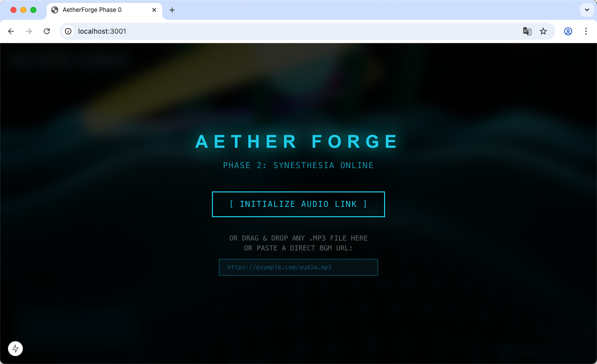
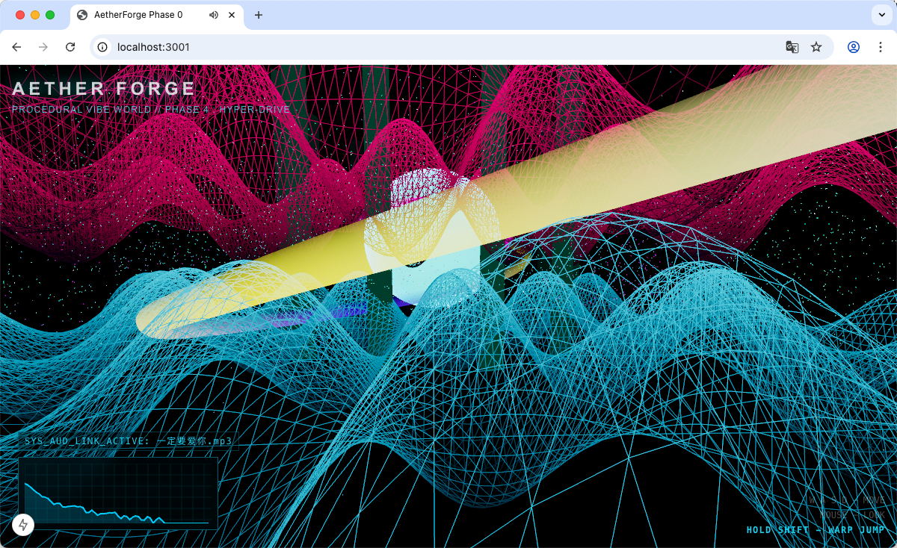

<div align="center">
  

  <h1>🌌 AetherForge </h1>
  <p><strong>A Next-Gen, Audio-Reactive WebGPU Universe</strong></p>
  
  <p>
    AetherForge is a procedural infinite vibe world built using cutting-edge WebGPU capabilities in Three.js and Next.js. It's not just a visualizer—it's a hyperspace engine that turns your favorite music into a living, breathing cyberpunk universe.
  </p>

  <div>
    
    
    
    
  </div>
</div>

---

## 🔥 Features that bend reality

AetherForge went through four extreme rendering phases to push browser limits to their maximum:

### 🎵 1. Synesthesia Audio Engine (Drag & Drop)
The world listens. You can drag and drop **any `.mp3` file** directly into the browser, or paste a remote stream URL. The engine uses `Tone.js` FFT to extract heavy bass frequencies, which are passed directly to the GPU shader memory. **The landscape violently shifts, glows, and crashes to the exact beat of your track.**

### 🪞 2. Holographic Thin-Film Iridescence
Say goodbye to basic flat shading. AetherForge deploys physically accurate `MeshPhysicalNodeMaterial` components for its orbital monoliths. These 100-meter-tall glass obelisks feature extreme high-ior **Iridescence**. As the bass drops, the thin-film thickness calculates real-time rainbow reflections (like a soap bubble acting under heavy gravity). 

### 🚀 3. Warp Drive Mechanic
Navigation isn't just floating. By pressing **[SHIFT]**, you engage the Warp Drive. The Camera FOV stretches to 120-degrees, stars elongate into hypersonic particles, and global WebGPU positional offsets simulate an insane speed multiplier.

### 📊 4. Glassmorphic Zero-Lag FFT HUD
A custom-built Canvas API UI panel parses the 64-band frequency output outside of the React rendering loop to guarantee a stutter-free 60FPS UI while maintaining a highly aesthetic cyberpunk dashboard monitor.

<br>

<div align="center">
  
</div>

<br>

## 🚀 Quick Start

Ensure you are using a modern browser that **supports WebGPU** (Chrome 113+, Edge 113+).

```bash
# 1. Clone the repository
git clone https://github.com/yourusername/aetherforge.git

# 2. Install Dependencies
cd aetherforge
npm install

# 3. Start the Next.js Hyper-Engine
npm run dev
```
Navigate to `http://localhost:3000` (or `3001`), accept the audio initialization overlay, or **drag an `.mp3` directly into the universe.**

## 🎮 Controls

| Key | Action |
| --- | --- |
| `W A S D` | Movement |
| `Mouse` | Look Around (Click to lock pointer) |
| `Space` | Ascend / Float Up |
| `C` | Descend / Sink |
| **`SHIFT` (Hold)** | **ENGAGE WARP DRIVE** |

## 🛠️ Stack & Architecture

- **Framework**: `Next.js 15` (App Router) + `React 19`
- **Engine**: `@react-three/fiber` + `three` (WebGPURenderer strict-mode)
- **Shaders**: Three.js Node Shader Language (`three/tsl`)
- **Audio Processing**: `Tone.js`

> **Note on Browser Compatibility**: AetherForge completely abandons WebGL fallback to utilize low-level WebGPU capabilities. Ensure your graphics drivers and browser are fully up-to-date.

---
<div align="center">
<p><i>Made with passion pushing the limits of the Open Web.</i></p>
</div>
